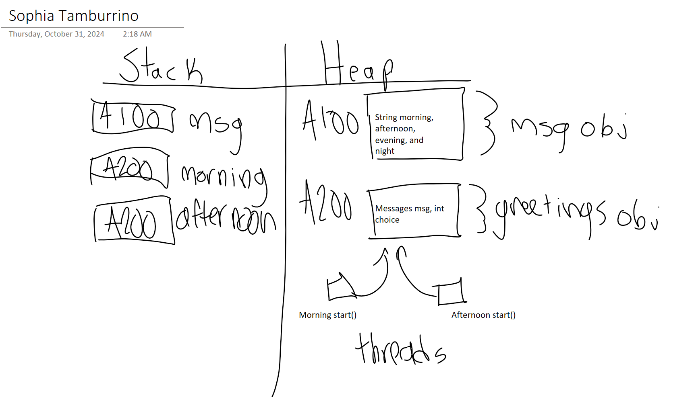

## #1 Compile the two files below and run the main method in the SimpleThreadExample.

The program enters the good afternoon thread, then starts the good morning thread, then exits afternoon and ends the morning thread.In between, sometimes there would be more good afternoons printed than good mornings. After running it a few times, it is not consistent.


## #2 Does the output change in any way? Does one thread always finish first, or does the order change?
The output does change and there is more of an even distribution of good afternoon and good morning prints. However, one thread does not always finish first and it is seemingly random.

## #3 Explain how it is possible that the main method is complete but the program is still producing output.

When the main method is called, a main thread is started. When the main method ends, the processes called in main can still be running in separate threads even though main ends before those threads.

## #4 Explain how attempting to join the first thread for 5 seconds affects the output of this program. 

You can see how the two messages collide after starting the afternoon thread in the middle of the 5 seconds. However it seems that the output is consistently the same every time, and that good afternoon waits until good morning has printed, and goes back and forth between the two until good morning ends.

## #5 What does join() do compared to join(10)?

Join() will make good afternoon wait until good morning ends before printing anything. Join(10) makes good afternoon join 10 milliseconds into the thread. 

## #6 What is the difference between isAlive() and join()? (note, no arguments to join.)
isAlive() checks if the thread is still running, just in case you want to wait until the thread is finished to begin another. join() automatically will wait until the thread is finished and then start another.

## #7 Then describe the output of this program. Explain why the threads finish in the order that they do.

The cheetah finishes first, then the hare, then the tortoise. This is because the higher the animalSpeed, the shorter time the thread will sleep for. For example, cheetah finishes first because the speed is 50, making the thread only sleep for 20, where the tortoise’s speed is 5, making it sleep for 200. 

## #8 Provide the modified code below. Then describe the output of this program. Explain why your modification worked or did not work.

This worked because I was able to make the hare start before the other two and join it for longer than tortoise and cheetah got to start.
``` Java
public class AnimalFootRace {
  public static void main(String[] args) {
      Thread tortoiseThread = new AnimalRacerThread("Tortoise", 5);
      Thread hareThread = new AnimalRacerThread("Hare", 20);
      Thread cheetahThread = new AnimalRacerThread("Cheetah", 50);

      System.out.println("On your marks, get set, go!");


      hareThread.start();
      try {
        System.out.println("Joining hare");
        hareThread.join(1000);
      } catch (InterruptedException e) {
        System.out.println("Interrupted while joining a thread...");
      }
      tortoiseThread.start();
      cheetahThread.start();
   
  }
}
```
## #9 Provide the modified code below. Then describe the output of this program.
I added an animal hippo with a speed of 15. It finished before tortoise in third place. 
```Java
/* AnimalFootRace.java */
public class AnimalFootRace {
  public static void main(String[] args) {
      Thread tortoiseThread = new AnimalRacerThread("Tortoise", 5);
      Thread hareThread = new AnimalRacerThread("Hare", 20);
      Thread cheetahThread = new AnimalRacerThread("Cheetah", 50);
      Thread hippoThread = new AnimalRacerThread("Hippo", 15);


      System.out.println("On your marks, get set, go!");
      tortoiseThread.start();
      hippoThread.start();
      hareThread.start();
      cheetahThread.start();
  }
}
```
## #10 Is it possible to create more than one instance of the Singleton class if two threads attempt to call the getInstance() method at the same time?
This is not possible because calling getInstance at the same time on both threads will cause an error. If we want to do this, we need the synchronized keyword.

## #11 How does the synchronized keyword affect the attempts to call the getInstance method from multiple threads at the same time? 
The synchronized keyword ensures that no two threads have method calls that overlap by temporarily delaying one thread. 

## #12 Does the execution halt? Does SimpleThreadTwo finish running? If not, why does SimpleThreadTwo get stuck in the while loop (hint: recall the compiler optimization example)?
It halts at 2000 and does not finish running. Because SimpleThreadTwo depends on a variable that can be changed across both of the two threads, there is an infinite while loop in line while (!statusFlag) because statusFlag can change in SimpleThreadOne.

## #13 Why does adding the volatile keyword before the boolean statusFlag change the behavior of the code compared to the previous question?
The code finished running because the volatile allows it to only focus on the current thread and won’t assume other threads are modifying the field.

## #14 How would you modify the code to protect the auction outcome?
Adding volatile to maxBid will give the correct output as it is being compared constantly and could be overridden by other threads.
